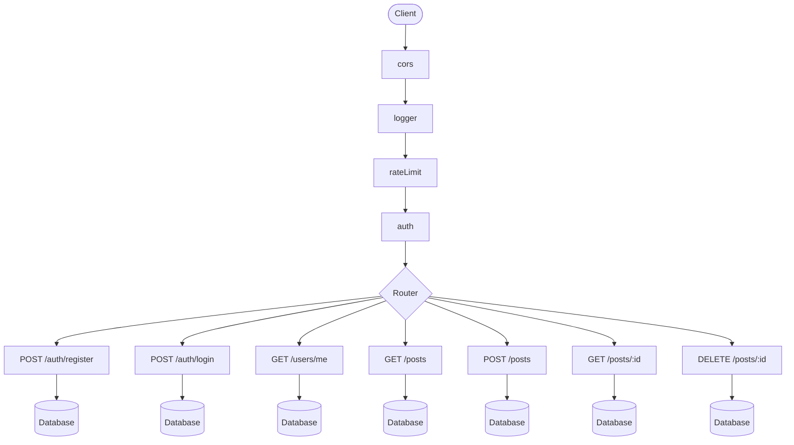

```mermaid
graph TD
  Client([Client])

  MW_cors[cors]
  Client --> MW_cors
  MW_logger[logger]
  MW_cors --> MW_logger
  MW_rateLimit[rateLimit]
  MW_logger --> MW_rateLimit
  MW_auth[auth]
  MW_rateLimit --> MW_auth
  Router{Router}
  MW_auth --> Router

  R_POST__auth_register["POST /auth/register"]
  Router --> R_POST__auth_register
  DB_R_POST__auth_register[(Database)]
  R_POST__auth_register --> DB_R_POST__auth_register
  R_POST__auth_login["POST /auth/login"]
  Router --> R_POST__auth_login
  DB_R_POST__auth_login[(Database)]
  R_POST__auth_login --> DB_R_POST__auth_login
  R_GET__users_me["GET /users/me"]
  Router --> R_GET__users_me
  DB_R_GET__users_me[(Database)]
  R_GET__users_me --> DB_R_GET__users_me
  R_GET__posts["GET /posts"]
  Router --> R_GET__posts
  DB_R_GET__posts[(Database)]
  R_GET__posts --> DB_R_GET__posts
  R_POST__posts["POST /posts"]
  Router --> R_POST__posts
  DB_R_POST__posts[(Database)]
  R_POST__posts --> DB_R_POST__posts
  R_GET__posts__id["GET /posts/:id"]
  Router --> R_GET__posts__id
  DB_R_GET__posts__id[(Database)]
  R_GET__posts__id --> DB_R_GET__posts__id
  R_DELETE__posts__id["DELETE /posts/:id"]
  Router --> R_DELETE__posts__id
  DB_R_DELETE__posts__id[(Database)]
  R_DELETE__posts__id --> DB_R_DELETE__posts__id
```